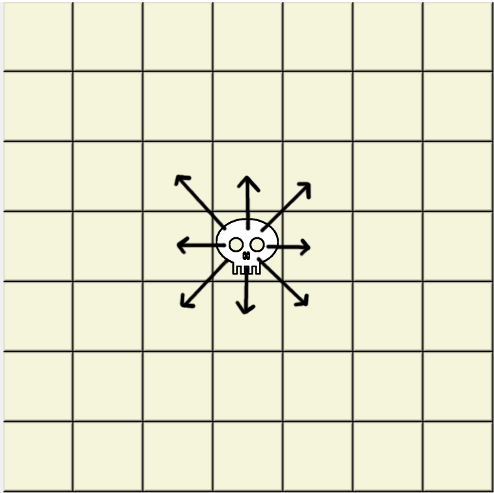
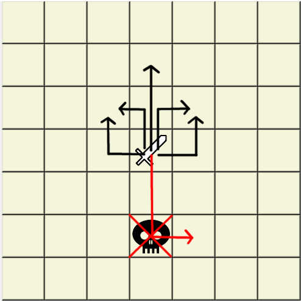
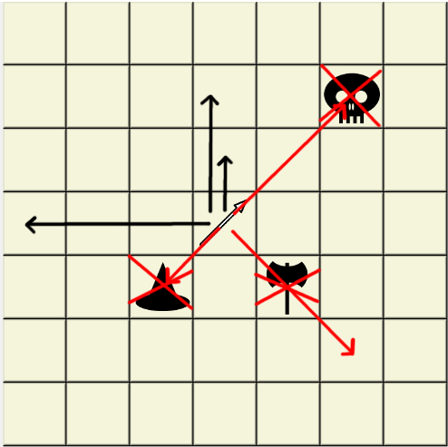
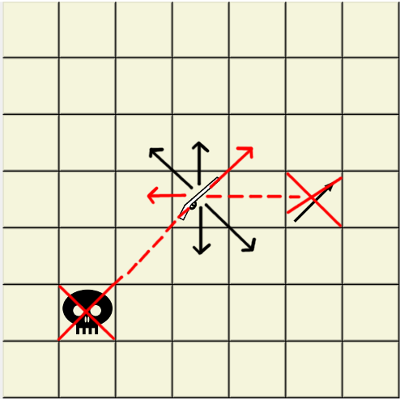
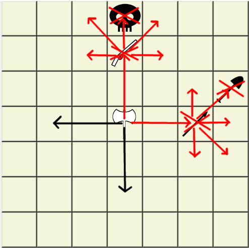
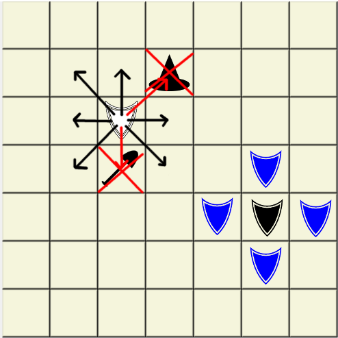
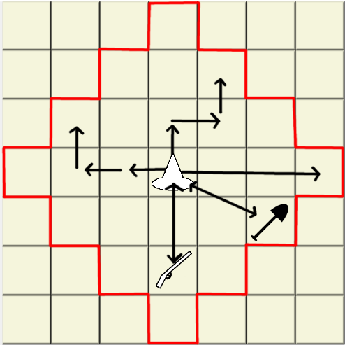
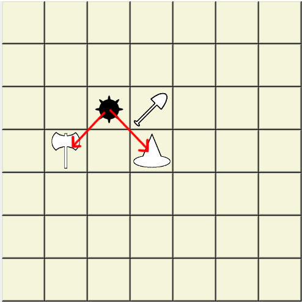

# Weird Chess Rules

It's like chess, but with weird pieces. Your goal is to kill enemy necromancer. There is no check, checkmate, castling, en pasant or promoting.

### Necromancer

Necromancer moves like chess king, but cannot kill. Whenever he moves, your longest dead piece is revived on necromancer's former position.  

### Swordsman

Swordsman moves by doing two orthogonal steps. Kills are performed by stepping next to enemy piece.  

### Spearman

Spearman moves orthogonaly and kills diagonaly one or two tiles.  

### Marksman

Marksman moves like chess king. Whenever he moves he kills unobscured enemy piece in opposite direction.  

### Berserk

Berserk moves and kills exactly two tiles orthogonaly. If he kills a piece, he can continue one tile forward, diagonaly or sideways in way he started. He can kill his allied pieces.  

### Guardian

Guardian moves and kills like chess king. He protects orthogonaly neighbouring pieces from being killed.  

### Mage

Mage teleports up to three orthogonal steps away. If he teleports on tile with any piece, they swap places.  

### Sapper and Mine

Sapper can go to any free tile. Whenever he moves, he leaves mine on his former position. If there is already a mine, it will be moved (there can be only one).  
When mine is killed, it kills piece that killed it (except marksman). Mine can kill (but not move) one tile diagonaly.  
